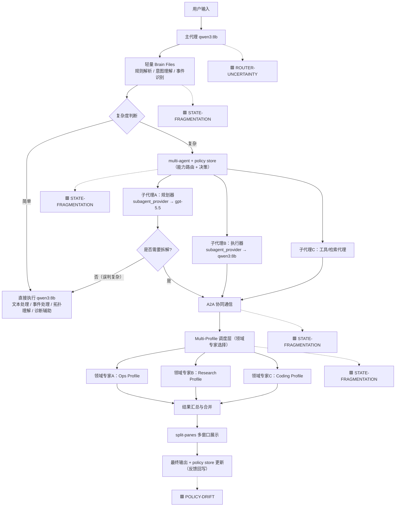

	

# 🧬 OpenCrabs Autonomic Ops

---
# 崩溃节点优先级（按系统风险排序）

| 优先级 | 节点 | 崩溃强度 | 影响范围 | 为什么优先 |
|--------|------|----------|----------|------------|
| P0 | Router (qwen3:8b) | 极高 | 全系统 | 所有任务分发入口，错误会被指数级放大 |
| P0 | System State Graph | 极高 | 全系统 | 状态不一致会导致所有 agent 决策基准错误 |
| P1 | Execution Layer | 高 | 生产环境 | 不可回滚操作直接造成不可逆损害 |
| P1 | Policy Store | 高 | 长期系统行为 | 错误策略会自我强化导致系统退化 |
| P2 | A2A / Multi-Agent | 中-高 | 局部爆炸 | 主要导致复杂度失控，但不一定立即破坏系统 |
---
